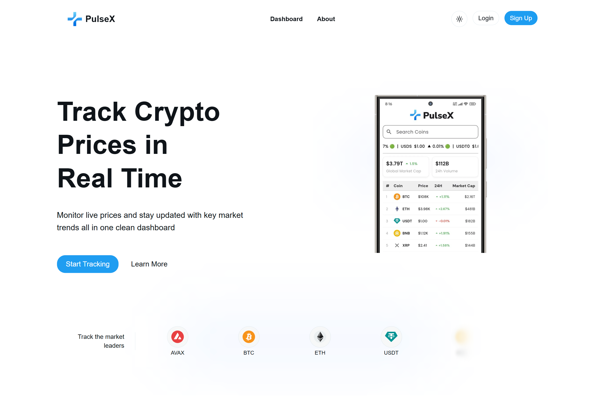
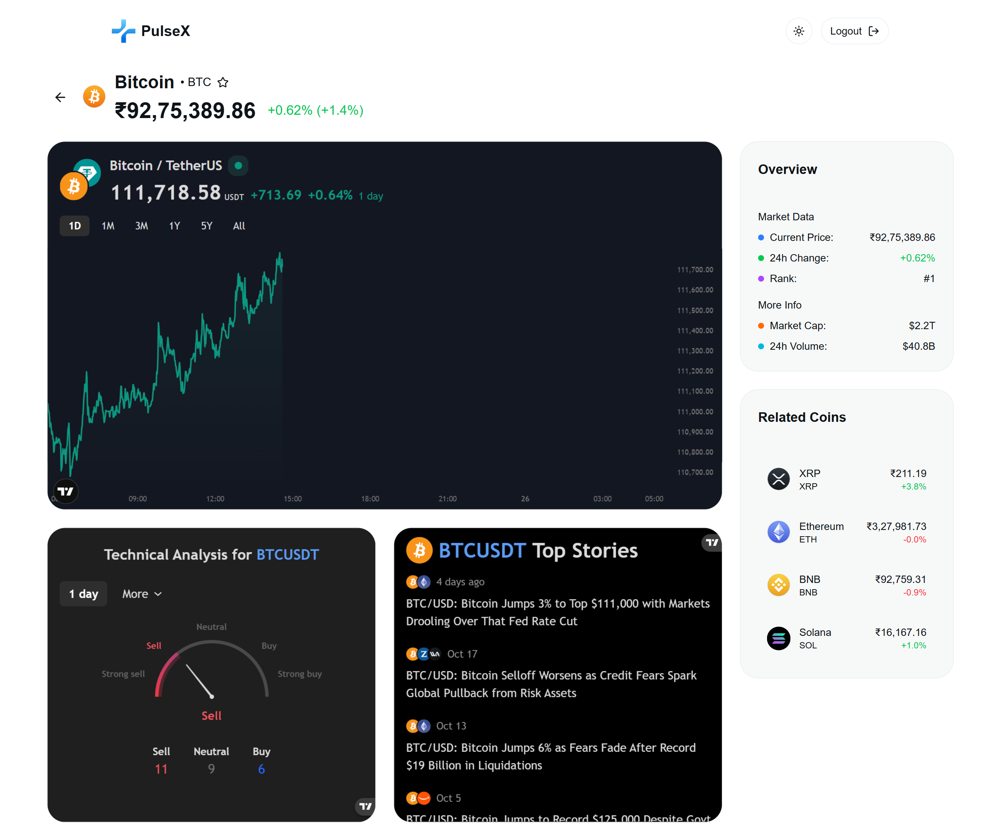

# PulseX - Cryptocurrency Portfolio Tracker

A modern, real-time cryptocurrency tracking web applicationfeaturing live market data, user authentication, and modern design.

## 🚀 Features

- **Real-time Crypto Data** - Live cryptocurrency prices and market data via CoinMarketCap API
- **User Authentication** - Secure login/signup with Better Auth and Google OAuth integration
- **Interactive Dashboard** - Comprehensive portfolio tracking with data visualization
- **Coin Details** - Individual cryptocurrency pages with TradingView charts and technical analysis
- **Responsive Design** - Mobile-first approach with dark/light theme support
- **Modern UI** - Built with Tailwind CSS and Radix UI components

## 🎨 Key Components

- **CryptoDashboard** - Main dashboard with cryptocurrency listings
- **CoinDetail** - Individual coin pages with charts and analysis
- **LoginForm/SignupForm** - Authentication forms

## 🔐 Authentication

PulseX uses Better Auth for secure authentication with support for:
- Email/password authentication
- Google OAuth integration

## 📊 Data Sources

- **CoinMarketCap API** - Real-time cryptocurrency data
- **TradingView Widgets** - Interactive charts and technical analysis
- **CoinCap Assets** - Cryptocurrency icons and images

---

Built with ❤️ by the PulseX Team